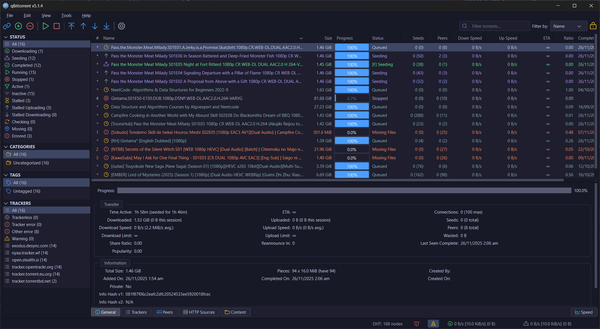

# Nova Dark Theme for qBittorrent

A modern, carefully crafted dark theme for qBittorrent featuring a refined color palette, semantic status colors, and a custom icon set.



## Features

- 🎨 **Modern Dark Palette** – Deep, easy-on-the-eyes background with excellent contrast
- 🚦 **Semantic Status Colors** – Distinct colors for each torrent state (downloading, seeding, stalled, error, etc.)
- 🎯 **90+ Custom Icons** – Phosphor icon set with meaningful color coding
- ✨ **Polished UI** – Consistent styling across all widgets, dialogs, and panels

## Install

1. Download `nova-dark-modern.qbtheme` from the [Releases](https://github.com/ehsan18t/qbt-theme/releases) page
2. In qBittorrent, go to **Tools → Options → Behavior**
3. Enable **Use custom UI Theme**
4. Browse to the downloaded `.qbtheme` file
5. Click **Apply**, then **OK**
6. Restart qBittorrent

## Build from Source

### Using Docker (Recommended)

```bash
docker build -t qbt-theme-builder .
docker run --rm -v "${PWD}:/workspace" qbt-theme-builder
```

> **Windows (PowerShell):** Use `${PWD}` as shown above, or the full path like `-v "C:\path\to\qbt-theme:/workspace"`

### Manual Build

- **Windows:** `scripts\build-nova-dark.bat`
- **Linux/macOS:** `./scripts/build-nova-dark.sh`

Output files are generated in `dist/`:
- `nova-dark-modern.qbtheme` – Full theme with custom icons
- `nova-dark-no-icons.qbtheme` – Stylesheet only

## Status Colors

| Status            | Color      |
| ----------------- | ---------- |
| Downloading       | 🔵 Blue     |
| Uploading/Seeding | 🟢 Green    |
| Forced            | 🟠 Orange   |
| Stalled           | ⚪ Gray     |
| Queued            | 🟣 Lavender |
| Error/Missing     | 🔴 Red      |

## License

MIT License
